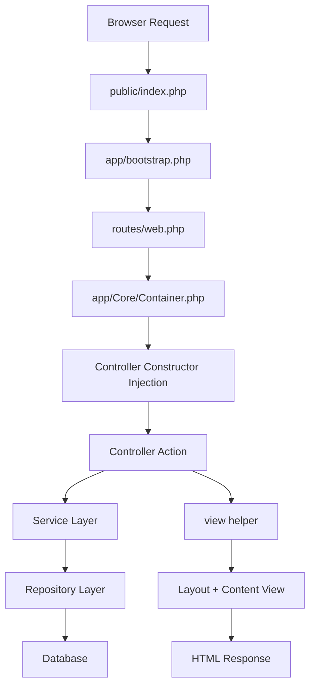

# ERP v2: Master Developer Guide

Welcome to the **ERP v2** project. This document is the single source of truth for the project's architecture, standards, and workflow. It is designed to allow any developer to understand the base structure without external help.

---

## 1. Getting Started

### 📋 Prerequisites
- **Server**: PHP 8.1+ (XAMPP recommended on Windows).
- **Extensions**: `pdo_mysql`, `mbstring`, `json`.
- **Database**: 
  - Host: `localhost`, Name: `erp_v2`, User: `root`, Pass: `""`.
  - Credentials are set in `app/Core/Database.php`.

### 🚀 Installation
1. Clone the repository into your web root (e.g., `htdocs/erp_v2`).
2. Visit `http://localhost/erp_v2` in your browser.
3. The root `index.php` automatically redirects to `public/index.php`.

---

## 2. Architecture Overview

We use a modern **Layered MVC** architecture with **Dependency Injection (DI)**.

### 🏗️ Request Lifecycle


### 📂 Directory Purpose
| Directory | Responsibility |
| :--- | :--- |
| `app/Core` | Framework logic: Database, Base Model, DI Container. |
| `app/Controllers` | Handles HTTP requests. Should contain **zero** business logic. |
| `app/Services` | **Business Logic Layer**. Where calculations and logic live. |
| `app/Repositories` | **Data Access Layer**. The only layer with SQL. Returns **Models**. |
| `app/Models` | **Data Representation**. Raw table mapping + entity logic. |
| `app/Middleware` | Guards for Auth and Permissions. |
| `views/` | UI templates (Layouts, Partials, Pages). |

---

## 3. Core Engine Details

### 🧩 Dependency Injection (`Container.php`)
The `Container` uses **Reflection** to automatically instantiate classes and their dependencies.
- **Rule**: Never manually use `new` for Services or Repositories.
- **Why?** It makes code testable and decoupled.

**Wrong ❌**
```php
public function store() {
    $service = new EmployeeService(); // Manual instantiation is forbidden
    $service->save($_POST);
}
```

**Right ✅**
```php
public function __construct(EmployeeService $service) {
    $this->service = $service; // Let the Container handle it
}
```

### 🖼️ Layout System (`view()` helper)
The `view()` function is located in `app/Helpers/functions.php`. It supports nested layouts.

**Syntax**: `view($viewPath, $data = [], $layout = null)`
- `$viewPath`: Uses dot notation (e.g., `employee.create` -> `views/employee/create.php`).
- `$layout`: The master template filename in `views/layouts/` (e.g., `'app'`).

**How it works**:
If `$layout` is provided, the function:
1. Extracts `$data` into variables.
2. Sets `$view` to the absolute path of the content file.
3. Includes the layout file (e.g., `views/layouts/app.php`).
4. The layout file then calls `include $view;` to inject the content.

### 💾 Base Model (`Model.php`)
Our models represent entities and their internal rules.
- **Properties**: Access columns as `$object->column_name`.
- **Entity Logic**: Methods like `isActive()` or `getFullName()` live here.
- **Note**: Models do **not** fetch themselves. Use a Repository!

---

## 4. Coding Standards (The "ERP Way")

### ✅ DOs
- **Keep Controllers Thin**: A controller action should rarely exceed 10-15 lines.
- **Use Services for Logic**: If you are calculating something or checking business rules, it belongs in a Service.
- **Use Repositories for Raw SQL**: If `Model::where()` isn't enough, use a Repository.
- **Sanitize Every Output**: Use `htmlspecialchars()` in views unless the helper handles it.
- **Use `redirectWithFlash()`**: To provide feedback to users after POST actions.

### ❌ DON'Ts
- **No `include` in Controllers**: Always use the `view()` helper.
- **No Raw SQL in Controllers**: Forbidden. Move it to a Repository or Model.
- **No Business Logic in Views**: Views should only contain `if`, `foreach`, and `echo`.
- **No manual `<header>` and `<footer>` inclusions**: Use the layout system.

---

## 5. Naming Convention Guide

| Entity | Convention | Example |
| :--- | :--- | :--- |
| **Controllers** | `PascalCase` + `Controller` suffix | `EmployeeController.php` |
| **Services** | `PascalCase` + `Service` suffix | `AuthService.php` |
| **Models** | `PascalCase` (Singular) | `User.php` |
| **Methods** | `camelCase` | `registerNewEmployee()` |
| **DB Tables** | `snake_case` (Plural) | `employee_details` |
| **Variables** | `camelCase` | `$userData` |

---

## 6. Access Control Flow

1. **Authentication**: `AuthMiddleware::check()` (Checks if `user_id` exists in session).
2. **Page Permission**: `PermissionService::hasPage('name')`.
3. **Action Permission**: `PermissionService::hasAction('action.name')`.

---
*The ERP v2 structure is built for scalability and maintainability. When in doubt, follow existing patterns in `EmployeeController`.*
