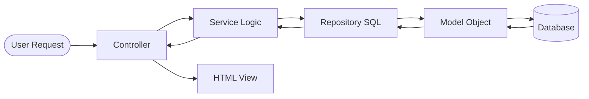

# 📔 ERP v2: Project Developer Handbook

This handbook is designed for junior developers to master the project structure and workflow. Follow this guide to build features that are scalable, secure, and clean.

---

## 🍽️ 1. The "Restaurant" Analogy
To understand why we have so many folders, imagine our app is a **Premium Restaurant**:

1.  **The Ingredient (Model):** `app/Models/`  
    "I am a Product. I have a name and a price."
2.  **The Librarian (Repository):** `app/Repositories/`  
    "I know where the products are kept in the pantry (Database). I fetch them and give them to the Chef."
3.  **The Chef (Service):** `app/Services/`  
    "I take the products, apply tax, check if they are in stock, and prepare the final data."
4.  **The Waiter (Controller):** `app/Controllers/`  
    "The customer ordered a product! I'll tell the Chef to prepare it and then serve it at the table."
5.  **The Table (View):** `views/`  
    "The beautiful plate the customer sees on their screen."

---

## 🗺️ 2. The Mental Map (Flow)

Before writing code, visualize this flow. Each layer has **ONE** job.

---

## 📂 3. Folder Navigation

| Folder | What goes here? |
| :--- | :--- |
| `app/Core/` | The engine (Database, Model, Container). **Don't touch** unless you are an expert. |
| `app/Controllers/` | One file per module (e.g., `ProductController.php`). |
| `app/Services/` | The business "Brain". Logic like auth or calculations. |
| `app/Repositories/` | **SQL lives here only.** |
| `app/Models/` | Definitions of your tables. |
| `views/` | HTML/PHP templates. |
| `public/` | Assets (CSS, JS, Images). |

---

## 🛠️ 4. The 5-Step Workbook Exercise

When you are asked to "Create a new Module" (e.g., **Customers**), follow these steps:

### **Step 1: The Model**
Create `app/Models/Customer.php`.
*   Extend `Model`.
*   Set `protected $table = 'customers';`.

### **Step 2: The Repository**
Create `app/Repositories/CustomerRepository.php`.
*   Write your `SELECT` queries here.
*   **Critical**: Always return a `new Customer($row)` or a list of them.

### **Step 3: The Service**
Create `app/Services/CustomerService.php`.
*   Inject the Repository.
*   Write logic like `checkCreditLimit()` or `register()`.

### **Step 4: The Controller**
Create `app/Controllers/CustomerController.php`.
*   Inject the Service.
*   Call the `view()` helper to show the page.

### **Step 5: The Route**
Open `routes/web.php` and map your Controller to a URL.
*   Example: `route('GET', '/customers', 'CustomerController@index');`

---

## 🛤️ 5. Defining a Path (Routing)

Whenever you want to add a page, you must tell the app where to find it in `routes/web.php`.

*   **GET**: For viewing pages (e.g., `route('GET', '/profile', ...)`).
*   **POST**: For submitting forms (e.g., `route('POST', '/profile/update', ...)`).
*   **The Handler**: Use the format `ControllerName@MethodName`.

---

## 📜 6. Golden Rules for Juniors

1.  **No SQL in Controllers or Models**: Only Repositories write SQL.
2.  **Use $properties**: Access model data as `$user->email`, not `$user['email']`.
3.  **Security First**: Never use `$_POST` variables directly in SQL. Use PDO prepared statements (`?` placeholders).
4.  **Dry Code**: If you write the same code twice, it probably belongs in a **Service** or **Helper**.
5.  **Thin Controllers**: Keep them simple. If it's more than 15 lines, move logic to a Service.

---

## 🎓 6. How to get help?
1.  Check `docs/DEVELOPER_GUIDE.md` for technical details.
2.  Read `app/Repositories/UserRepository.php` to see a perfect example.
3.  **Ask!** We value developers who ask questions before making a mess!

---
*Created with ❤️ for the ERP v2 Team*
